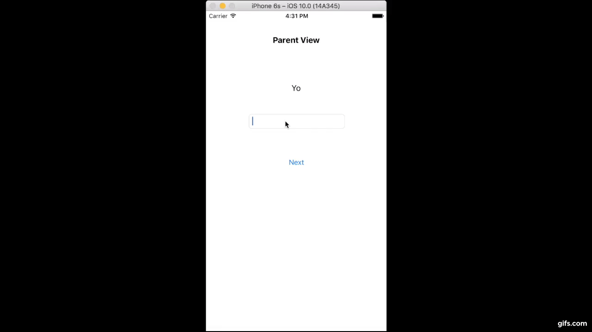

# Unwinding Storyboard Segues

## Example:
1. User types "cat" in the first view and presses "next" button.
2. User sees "cat" on the label of the second view
3. User types "rat" in the textfield of the second view and presses "prev"
4. User sees "rat" on the label of the first view

## Demo

